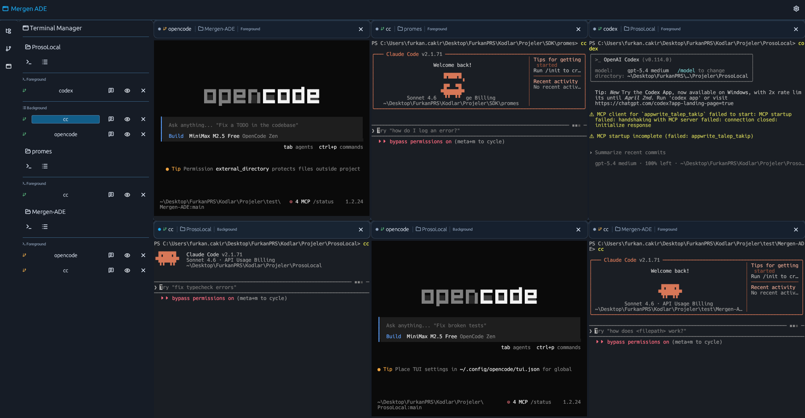

<p align="center">
  
</p>

<h1 align="center">Mergen ADE</h1>

<p align="center">
  Windows-first terminal workspace for running and organizing multiple project contexts.
</p>

<p align="center">
  <a href="https://github.com/furkancak1r/mergen-ade/releases/latest"><strong>Download Releases</strong></a>
  |
  <a href="#build-from-source"><strong>Build from Source</strong></a>
</p>

<p align="center">
  No release published yet? Use the one-command local build below.
</p>

<p align="center">
  
</p>

Mergen ADE is a desktop ADE focused on terminal orchestration, project context switching, and lightweight workspace management. The project is still Windows-first, with a signed and notarized macOS ARM64 DMG now produced alongside official GitHub releases.

It is not an IDE. There is no built-in editor, LSP, or debugger UI in this project.

## Why Mergen ADE

- Keep multiple terminals visible without turning your desktop into window clutter.
- Group sessions by project so context switches stay fast and predictable.
- Run a native Rust desktop app instead of a browser or Electron shell.
- Persist only the small amount of state that helps you get back to work quickly.

## Quick Start

### Download release assets

The canonical download location is the GitHub Releases page:

- https://github.com/furkancak1r/mergen-ade/releases/latest

Published assets currently target:

- Windows: portable ZIP containing `mergen-ade.exe`
- macOS: signed and notarized ARM64 DMG

### Local build

Preferred one-command build:

```powershell
powershell -ExecutionPolicy Bypass -File .\scripts\build-release.ps1
```

This produces the portable Windows executable at:

```text
target\x86_64-pc-windows-msvc\release\mergen-ade.exe
```

For normal local development:

```powershell
cargo build --release
cargo test
```

For an experimental native macOS build, use an explicit target because the repo default target remains Windows-oriented:

```bash
cargo build --release --target aarch64-apple-darwin
```

This produces the macOS binary at:

```text
target/aarch64-apple-darwin/release/mergen-ade
```

If `cargo` is not on PATH in PowerShell:

```powershell
$env:USERPROFILE\.cargo\bin\cargo.exe build --release
$env:USERPROFILE\.cargo\bin\cargo.exe test
```

## Core Features

- Native Rust desktop app with a Windows-first release path
- Embedded terminal panes with tiled layout management
- Project-aware terminal grouping in the side panel
- ConPTY-backed shell sessions with responsive IO flow
- Lightweight local TOML configuration
- Portable Windows release pipeline through GitHub Actions
- Signed and notarized macOS ARM64 DMG packaging in GitHub Actions

## How It Works

- Terminal sessions are created through `portable-pty` using the native PTY backend of the current platform.
- Terminal emulation and parsing are handled by `tattoy-wezterm-term`.
- PTY reads, writes, and resize handling run off the UI thread to keep the app responsive.
- The main window combines an activity rail, collapsible side panels, and tiled terminal panes.

## UI Overview

- **Activity rail:** icon-first left rail for switching between `Project Explorer` and `Terminal Manager`
- **Project Explorer:** project picker, quick actions, search, indexed folder tree, and source control view
- **Terminal Manager:** project-grouped foreground and background terminal lists
- **Main area:** embedded tiled terminal panes for concurrent terminal work
- **Terminal visibility mode:** configurable between global visibility and selected-project-only visibility

## Build From Source

The release script is the supported path for a portable Windows binary.

What it does:

1. Builds a portable release for `x86_64-pc-windows-msvc`
2. Ensures the `stable-x86_64-pc-windows-msvc` toolchain is available
3. Resolves the local Visual Studio build environment when needed
4. Statically links the MSVC CRT for a portable EXE workflow
5. Verifies imports with repo-local `llvm-objdump.exe` when available, otherwise `dumpbin.exe`
6. Produces `target\x86_64-pc-windows-msvc\release\mergen-ade.exe`

Regression check:

```powershell
powershell -ExecutionPolicy Bypass -File .\scripts\__tests__\build-release.tests.ps1
```

For macOS release packaging, GitHub Actions builds `aarch64-apple-darwin`, wraps the binary in a minimal `.app`, signs it with a Developer ID Application certificate, notarizes the DMG through `notarytool`, staples the notarization ticket onto the DMG, and only then runs the final Gatekeeper-style DMG assessment before publishing. The same script can still package locally without signing when the Apple credentials are not provided.

## GitHub Releases

This repository includes a release workflow at `.github/workflows/release.yml`.

When a tag starting with `v` is pushed, GitHub Actions will:

1. Build the portable `mergen-ade.exe` for `x86_64-pc-windows-msvc`
2. Package it as `mergen-ade-<tag>-windows-x64-portable.zip`
3. Build, sign, notarize, and staple `mergen-ade-<tag>-macos-arm64.dmg`
4. Publish a GitHub Release and attach every packaged asset that was produced

The macOS DMG is currently:

- ARM64 only
- signed with a Developer ID Application certificate and notarized through Apple
- required for official tagged releases; if signing, notarization, or DMG packaging fails, the release workflow fails instead of publishing a broken Windows-only release
- expected to open without the prior "damaged" Gatekeeper warning on a clean supported macOS installation

Maintainer release prerequisites:

- GitHub repository secrets: `APPLE_DEVELOPER_ID_APP_CERT_BASE64`, `APPLE_DEVELOPER_ID_APP_CERT_PASSWORD`, `APPLE_DEVELOPER_IDENTITY`, `APPLE_NOTARY_API_KEY_ID`, `APPLE_NOTARY_API_ISSUER_ID`, `APPLE_NOTARY_API_PRIVATE_KEY_BASE64`
- Apple Developer membership with a Developer ID Application certificate exported as `.p12`
- App Store Connect API key with notarization access

This is safe for a public repository because the signing material stays in GitHub Actions secrets and the release workflow runs only on tag pushes in the base repository.

Maintainer tag example:

```powershell
git tag v0.1.0
git push origin v0.1.0
```

## Configuration

Config is stored in platform app data via `ProjectDirs`.

On Windows the current path is:

- `%APPDATA%\Mergen\MergenADE\config\config.toml`

On macOS, `ProjectDirs` resolves under the user's Library application support/config directories.

Persisted data includes:

- global default shell
- projects with id, name, and path
- per-project saved messages
- UI state such as visible panels, selected project, filter mode, and auto tile scope

Not persisted:

- terminal scrollback
- live terminal sessions

## Testing

The project currently includes unit tests for:

- tiling grid calculation in `src/layout.rs`
- terminal title update logic in `src/title.rs`
- platform-specific shell/config and file-open command behavior
- Windows release helper regressions in `scripts/__tests__/build-release.tests.ps1`

Run checks:

```powershell
cargo test
powershell -ExecutionPolicy Bypass -File .\scripts\__tests__\build-release.tests.ps1
```

## Non-goals

- Built-in code editor
- LSP or debugger workflows
- Telemetry, sign-in, or online account features

## Build Troubleshooting

- `link.exe not found`
  - Install Visual Studio Build Tools or Visual Studio 2022 with `Desktop development with C++`, then rerun the release script.
- `Required x64 MSVC/SDK libraries were not found in LIB`
  - Install the Windows SDK and MSVC CRT libraries that ship with the Desktop development with C++ workload, then rerun the release script.
- `MSVC Rust toolchain not found`
  - The release script provisions `stable-x86_64-pc-windows-msvc` automatically when `rustup` is available.
- `toolchain 'stable-x86_64-pc-windows-msvc' is not installed`
  - The release script installs it automatically through `rustup toolchain install ... --profile minimal`.
- `dependency tool not found`
  - The release script first checks repo-local `llvm-objdump.exe`, then resolves `dumpbin.exe` from Visual Studio or Build Tools even outside Developer PowerShell.
- `x86_64-w64-mingw32-clang.exe not found`
  - Plain local `cargo` builds still depend on the repo-local LLVM-MinGW linker configured in `.cargo\config.toml`; make sure `.toolchain\llvm-mingw-20260224-ucrt-x86_64\bin` exists.

## License

This project is licensed under the MIT License. See [LICENSE](LICENSE).
